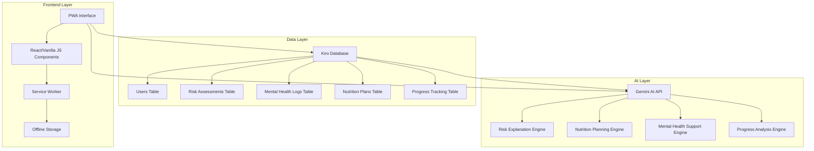
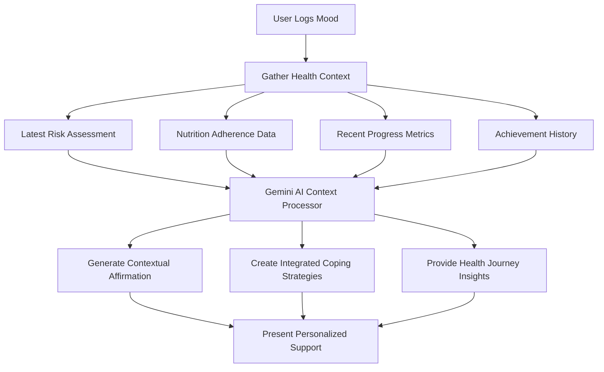

# Design Document

## Overview

GlucoBalance is a mobile-first Progressive Web Application (PWA) designed for comprehensive diabetes prevention, early detection, and ongoing management. The application integrates the Kiro database for robust data management and Gemini AI for intelligent, personalized health insights. The design emphasizes user-centric experience with a clean Azure Blue (#007FFF) and White aesthetic, card-based UI components, and seamless cross-platform accessibility.

The application follows a modular architecture with clear separation of concerns between frontend presentation, backend data management, and AI-powered intelligence layers. This design ensures scalability, maintainability, and optimal performance across mobile and desktop platforms.

## Architecture

### System Architecture Overview



### Technology Stack

- **Frontend Framework**: Progressive Web App with vanilla JavaScript or React with Tailwind CSS
- **Database**: Kiro Database with IndexedDB fallback for offline functionality
- **AI Integration**: Gemini API for intelligent content generation and analysis
- **Authentication**: Basic user authentication with secure session management
- **Deployment**: PWA deployment for cross-platform accessibility
- **Offline Support**: Service Worker with intelligent caching strategies

### Data Flow Architecture

1. **User Interaction Layer**: Captures user inputs through intuitive mobile-first interface
2. **Business Logic Layer**: Processes user data and coordinates between database and AI services
3. **Data Persistence Layer**: Manages data storage through Kiro database with offline fallback
4. **AI Intelligence Layer**: Provides personalized insights and recommendations via Gemini API
5. **Presentation Layer**: Renders dynamic content with real-time updates and responsive design

## Components and Interfaces

### Core Application Components

#### 1. Landing Page Module
- **LandingPageController**: Manages the clean, minimalist landing page layout and interactions
- **NavigationManager**: Handles navigation bar and fixed menu bar functionality
- **HeroSectionRenderer**: Creates and displays the prominent hero section with value proposition
- **FeatureCardSystem**: Manages interactive feature cards with expandable content display
- **ContentOverlayManager**: Controls the display and dismissal of feature card content panels
- **RiskAssessmentLauncher**: Handles the transition from Risk Assessment card to questionnaire

#### 2. Authentication Module
- **UserAuthService**: Manages user registration, login, and session persistence
- **ProfileManager**: Handles user profile data and preferences
- **SecurityLayer**: Implements data encryption and secure storage

#### 2. Risk Assessment Engine
- **AssessmentController**: Manages WHO/ADA-compliant questionnaire flow
- **RiskCalculator**: Computes diabetes risk scores based on assessment responses
- **AIExplanationService**: Integrates with Gemini AI for explainable risk insights
- **ResultsPresenter**: Displays risk results with empathetic, actionable recommendations

#### 3. Nutrition Planning System
- **MealPlanGenerator**: Creates personalized 3-day meal plans using AI
- **CulturalAdaptationEngine**: Adapts meal recommendations to local cuisines
- **AdherenceTracker**: Monitors and records user meal plan compliance
- **NutritionAnalytics**: Provides insights on dietary patterns and improvements

#### 4. Mental Health Support Module
- **MoodTracker**: Captures daily mood ratings with emoji interface
- **AffirmationEngine**: Generates personalized affirmations via Gemini AI
- **CopingStrategiesGenerator**: Provides AI-powered emotional support recommendations
- **MoodAnalytics**: Analyzes mood trends and patterns over time
- **ContextAwareSupport**: Integrates user's complete health profile for personalized mental health content
- **HealthJourneyIntegrator**: Connects mental wellness to diabetes prevention progress and achievements

#### 5. Progress Dashboard System
- **DataAggregator**: Consolidates health metrics from multiple sources
- **VisualizationEngine**: Creates interactive charts and progress indicators
- **AIInsightsGenerator**: Produces personalized health insights and recommendations
- **AchievementTracker**: Monitors milestones and celebrates user progress

#### 6. Doctor Report Generator
- **DataCompiler**: Aggregates 30-day health data for clinical reporting
- **ReportFormatter**: Creates professional, clinician-ready document formats
- **AIReportAnalyzer**: Uses Gemini AI to highlight key trends and insights
- **PDFExporter**: Generates downloadable reports for healthcare providers

### Interface Specifications

#### Landing Page Interfaces

```javascript
// Landing Page Management Interface
interface LandingPageService {
  initializePage(): Promise<void>
  renderHeroSection(): HTMLElement
  createFeatureCards(): FeatureCard[]
  handleCardInteraction(cardId: string): Promise<void>
  displayCardContent(cardId: string, content: CardContent): void
  closeCardContent(cardId: string): void
}

// Feature Card Interface
interface FeatureCard {
  id: string
  title: string
  description: string
  icon: string
  category: 'health-management' | 'assessment' | 'nutrition' | 'mental-health'
  contentType: 'modal' | 'sidebar' | 'inline'
  onClick: () => void
}

// Navigation Interface
interface NavigationService {
  renderNavigationBar(): HTMLElement
  renderFixedMenuBar(): HTMLElement
  handleMenuInteraction(menuItem: string): void
  updateActiveSection(sectionId: string): void
}
```

#### Database Interfaces

```javascript
// User Management Interface
interface UserService {
  createUser(userData: UserData): Promise<User>
  getUser(userId: string): Promise<User>
  updateUser(userId: string, updates: Partial<User>): Promise<User>
  authenticateUser(credentials: LoginCredentials): Promise<AuthResult>
}

// Risk Assessment Interface
interface RiskAssessmentService {
  saveAssessment(userId: string, assessmentData: AssessmentData): Promise<Assessment>
  getUserAssessments(userId: string, limit?: number): Promise<Assessment[]>
  getLatestAssessment(userId: string): Promise<Assessment>
}

// Mood Tracking Interface
interface MoodTrackingService {
  saveMood(userId: string, date: string, mood: number, notes?: string): Promise<MoodEntry>
  getUserMoods(userId: string, days?: number): Promise<MoodEntry[]>
  getMoodByDate(userId: string, date: string): Promise<MoodEntry>
}
```

#### AI Service Interfaces

```javascript
// Gemini AI Integration Interface
interface AIService {
  explainRiskScore(score: number, assessmentData: object): Promise<string>
  generatePersonalizedRecommendations(userData: object): Promise<string>
  generateMealPlan(preferences: MealPlanPreferences): Promise<MealPlan>
  generateMoodAffirmation(mood: number, context?: object): Promise<string>
  analyzeProgressTrends(progressData: object): Promise<string>
}

// Content Generation Interface
interface ContentGenerator {
  generateHealthInsights(userProfile: UserProfile): Promise<HealthInsight>
  createMotivationalMessage(achievements: Achievement[]): Promise<string>
  generateCopingStrategies(mood: number, stressors: string[]): Promise<string[]>
  generateContextAwareAffirmation(mood: number, healthContext: HealthContext): Promise<string>
  createIntegratedCopingStrategies(mood: number, healthProfile: CompleteHealthProfile): Promise<string[]>
}

// Context-Aware Mental Health Interface
interface ContextAwareMentalHealthService {
  generateContextualAffirmation(userId: string, mood: number): Promise<string>
  createIntegratedCopingStrategies(userId: string, mood: number): Promise<string[]>
  analyzeHealthJourneyProgress(userId: string): Promise<HealthJourneyInsight>
  generateMilestoneAffirmation(userId: string, achievements: Achievement[]): Promise<string>
}

// Health Context Interface
interface HealthContext {
  latestRiskAssessment?: RiskAssessment
  nutritionAdherence?: number
  recentAchievements?: Achievement[]
  progressTrends?: ProgressTrend[]
  upcomingGoals?: Goal[]
}
```

## Landing Page Design Architecture

### Visual Design Principles

The GlucoBalance landing page embodies a clean, minimalist aesthetic that immediately conveys professionalism and calm. The design leverages generous white space to create a sense of breathing room and focus, while the Azure Blue (#007FFF) and White color scheme maintains brand consistency throughout the user experience.

### Layout Structure

#### 1. Navigation System
- **Primary Navigation Bar**: Fixed at the top with clean typography and subtle hover effects
- **Fixed Menu Bar**: Persistent navigation element providing quick access to key sections
- **Responsive Design**: Adapts seamlessly across desktop, tablet, and mobile viewports

#### 2. Hero Section Design
- **Prominent Positioning**: Takes up the primary viewport real estate with compelling value proposition
- **Clean Typography**: Large, readable fonts with clear hierarchy
- **Minimal Visual Elements**: Focus on messaging rather than decorative elements
- **Call-to-Action**: Clear, prominent button leading to user registration or assessment

#### 3. Interactive Feature Cards System
- **Grid Layout**: Organized card-based presentation of key features
- **Hover States**: Subtle animations and visual feedback on interaction
- **Content Expansion**: Cards reveal detailed content in adjacent panels when clicked
- **Persistent Display**: Content remains visible until user explicitly closes it
- **Smooth Transitions**: Animated content appearance and dismissal

### Feature Card Categories

#### Comprehensive Health Management Section
- **Risk Assessment Card**: Primary card that launches the WHO/ADA diabetes questionnaire
- **Progress Tracking Card**: Displays dashboard and analytics capabilities
- **Health Insights Card**: Showcases AI-powered personalized recommendations

#### Nutrition and Lifestyle Section
- **Meal Planning Card**: Demonstrates AI-generated culturally-adapted meal plans
- **Adherence Tracking Card**: Shows nutrition monitoring and lifestyle tips
- **Cultural Adaptation Card**: Highlights local cuisine integration

#### Mental Health Support Section
- **Mood Tracking Card**: Presents daily mood logging interface
- **AI Affirmations Card**: Shows personalized emotional support features
- **Coping Strategies Card**: Demonstrates AI-generated mental health resources

### Content Display Mechanism

When users interact with feature cards, the system displays relevant content using one of three presentation modes:

1. **Inline Expansion**: Content appears directly below the card within the grid
2. **Sidebar Panel**: Content slides in from the right side of the screen
3. **Modal Overlay**: Content appears in a centered overlay with backdrop

The choice of presentation mode depends on content type and screen size, ensuring optimal user experience across all devices.

## Data Models

### Core Data Structures

#### User Model
```javascript
interface User {
  id: string
  name: string
  email: string
  age: number
  gender: 'male' | 'female' | 'other'
  createdAt: string
  updatedAt: string
  preferences: UserPreferences
  baselineRisk?: number
}

interface UserPreferences {
  notifications: NotificationSettings
  dietary: DietaryPreferences
  language: string
  timezone: string
}
```

#### Risk Assessment Model
```javascript
interface RiskAssessment {
  id: string
  userId: string
  date: string
  score: number
  category: 'Low' | 'Increased' | 'High' | 'Possible Diabetes'
  responses: AssessmentResponse[]
  aiExplanation: string
  recommendations: string[]
  createdAt: string
}

interface AssessmentResponse {
  questionId: string
  value: number
  text: string
}
```

#### Mental Health Model
```javascript
interface MoodEntry {
  id: string
  userId: string
  date: string
  mood: number // 1-5 scale
  notes?: string
  aiAffirmation?: string
  copingStrategies?: string[]
  contextualAffirmation?: string
  integratedCopingStrategies?: string[]
  healthContext?: HealthContext
  createdAt: string
}

interface CompleteHealthProfile {
  user: User
  latestRiskAssessment?: RiskAssessment
  recentMoodTrends: MoodEntry[]
  nutritionAdherence: number
  progressMetrics: ProgressMetric[]
  achievements: Achievement[]
  upcomingGoals: Goal[]
}

interface HealthJourneyInsight {
  overallProgress: string
  mentalHealthConnection: string
  personalizedRecommendations: string[]
  celebratedAchievements: string[]
  motivationalMessage: string
}
```

#### Nutrition Model
```javascript
interface NutritionPlan {
  id: string
  userId: string
  planType: '3-day' | '7-day' | 'custom'
  cuisine: string
  dietaryRestrictions: string[]
  meals: DailyMealPlan[]
  adherenceTracking: AdherenceRecord[]
  createdAt: string
}

interface DailyMealPlan {
  day: number
  breakfast: MealItem[]
  lunch: MealItem[]
  dinner: MealItem[]
  snacks: MealItem[]
}
```

### Context-Aware Mental Health Support Architecture

#### Integration Strategy

The enhanced mental health support system integrates multiple data sources to provide comprehensive, context-aware emotional support:

1. **Health Profile Aggregation**: Combines risk assessment results, nutrition adherence, progress metrics, and mood history
2. **AI Context Processing**: Uses Gemini AI to analyze the complete health picture for personalized content generation
3. **Dynamic Content Adaptation**: Adjusts affirmations and coping strategies based on current health journey status
4. **Progress-Linked Motivation**: Connects mental wellness support to specific diabetes prevention achievements

#### Context-Aware Content Generation Flow



#### Enhanced AI Prompt Engineering

The system uses sophisticated prompt engineering to ensure Gemini AI generates contextually relevant mental health content:

- **Risk-Aware Messaging**: Incorporates current diabetes risk level into supportive messaging
- **Progress-Celebrating Content**: Acknowledges specific health improvements and milestones
- **Challenge-Addressing Strategies**: Provides coping mechanisms for specific health-related stressors
- **Goal-Oriented Motivation**: Connects mental wellness to upcoming health objectives

### Database Schema Implementation

The Kiro database will implement the following table structures:

#### Users Table
- **Primary Key**: id (auto-increment)
- **Indexes**: email (unique), createdAt
- **Fields**: name, email, age, gender, preferences (JSON), baselineRisk, createdAt, updatedAt

#### RiskAssessments Table
- **Primary Key**: id (auto-increment)
- **Foreign Key**: userId → Users.id
- **Indexes**: userId, createdAt, riskScore
- **Fields**: userId, date, score, category, responses (JSON), explanation (TEXT), createdAt

#### MentalHealthLogs Table
- **Primary Key**: id (auto-increment)
- **Foreign Key**: userId → Users.id
- **Indexes**: userId, date, mood
- **Fields**: userId, date, mood, notes, supportMessage (TEXT), createdAt

#### NutritionPlans Table
- **Primary Key**: id (auto-increment)
- **Foreign Key**: userId → Users.id
- **Indexes**: userId, createdAt, planType
- **Fields**: userId, planType, cuisine, restrictions (JSON), mealPlan (JSON), adherence (FLOAT), createdAt

#### ProgressTracking Table
- **Primary Key**: id (auto-increment)
- **Foreign Key**: userId → Users.id
- **Indexes**: userId, date, metricType
- **Fields**: userId, metricType, value, date, metadata (JSON), createdAt

## Error Handling

### Error Classification and Response Strategy

#### 1. Network and Connectivity Errors
- **Offline Mode**: Graceful degradation with cached data and local storage
- **API Failures**: Fallback to pre-defined responses and retry mechanisms
- **Timeout Handling**: Progressive timeout with user feedback and retry options

#### 2. Data Validation Errors
- **Input Validation**: Real-time validation with clear error messages
- **Data Integrity**: Server-side validation with rollback capabilities
- **Type Safety**: TypeScript interfaces for compile-time error prevention

#### 3. AI Service Errors
- **Gemini API Failures**: Fallback to curated content library
- **Rate Limiting**: Intelligent queuing and user notification
- **Content Quality**: Response validation and filtering mechanisms

#### 4. Database Errors
- **Connection Issues**: Automatic retry with exponential backoff
- **Data Corruption**: Integrity checks and recovery procedures
- **Storage Limits**: Proactive cleanup and user notification

### Error Recovery Mechanisms

```javascript
class ErrorHandler {
  static async handleAIError(error, fallbackContent) {
    console.error('AI Service Error:', error);
    
    // Log error for monitoring
    await this.logError('AI_SERVICE', error);
    
    // Return fallback content
    return fallbackContent || this.getDefaultContent();
  }
  
  static async handleDatabaseError(error, operation) {
    console.error('Database Error:', error);
    
    // Attempt local storage fallback
    if (this.isOfflineCapable(operation)) {
      return await this.executeOffline(operation);
    }
    
    // Show user-friendly error message
    this.showUserError('Unable to save data. Please try again.');
  }
}
```

## Testing Strategy

### Comprehensive Testing Approach

#### 1. Unit Testing
- **Component Testing**: Individual component functionality and props
- **Service Testing**: Database operations and AI integration methods
- **Utility Testing**: Helper functions and data transformation logic
- **Coverage Target**: 90% code coverage for critical paths

#### 2. Integration Testing
- **API Integration**: Gemini AI service integration and response handling
- **Database Integration**: Kiro database operations and data consistency
- **Cross-Component**: Data flow between components and services
- **Offline Functionality**: Service worker and offline data synchronization

#### 3. End-to-End Testing
- **User Workflows**: Complete user journeys from registration to report generation
- **Cross-Platform**: Testing across different devices and browsers
- **Performance Testing**: Load times, responsiveness, and resource usage
- **Accessibility Testing**: Screen reader compatibility and keyboard navigation

#### 4. AI-Specific Testing
- **Response Quality**: Validation of AI-generated content appropriateness
- **Fallback Testing**: Ensuring graceful degradation when AI services fail
- **Content Filtering**: Verification of medical accuracy and safety
- **Personalization Testing**: Validation of context-aware recommendations

### Testing Implementation

```javascript
// Example test structure
describe('Risk Assessment Service', () => {
  test('should calculate risk score correctly', async () => {
    const assessmentData = mockAssessmentData();
    const result = await riskService.calculateRisk(assessmentData);
    
    expect(result.score).toBeGreaterThanOrEqual(0);
    expect(result.category).toMatch(/Low|Increased|High|Possible Diabetes/);
  });
  
  test('should handle AI explanation generation', async () => {
    const mockScore = 15;
    const explanation = await aiService.explainRiskScore(mockScore, {});
    
    expect(explanation).toBeDefined();
    expect(explanation.length).toBeGreaterThan(50);
  });
});
```

### Performance Optimization

#### 1. Frontend Optimization
- **Code Splitting**: Lazy loading of non-critical components
- **Image Optimization**: WebP format with fallbacks and lazy loading
- **Caching Strategy**: Intelligent service worker caching for static assets
- **Bundle Optimization**: Tree shaking and minification for production builds

#### 2. Database Optimization
- **Query Optimization**: Efficient indexing and query patterns
- **Data Pagination**: Limit data retrieval for large datasets
- **Caching Layer**: In-memory caching for frequently accessed data
- **Connection Pooling**: Efficient database connection management

#### 3. AI Integration Optimization
- **Request Batching**: Combine multiple AI requests where possible
- **Response Caching**: Cache AI responses for similar queries
- **Fallback Content**: Pre-generated content for common scenarios
- **Rate Limit Management**: Intelligent queuing and prioritization

## Security Considerations

### Data Protection and Privacy

#### 1. Data Encryption
- **At Rest**: AES-256 encryption for sensitive health data
- **In Transit**: TLS 1.3 for all API communications
- **Client-Side**: Encrypted local storage for offline data

#### 2. Authentication and Authorization
- **Secure Authentication**: Multi-factor authentication options
- **Session Management**: Secure token-based authentication with expiration
- **Role-Based Access**: Granular permissions for different user types

#### 3. Privacy Compliance
- **GDPR Compliance**: Data portability and right to deletion
- **HIPAA Considerations**: Health data handling best practices
- **Consent Management**: Clear consent mechanisms for data usage

#### 4. API Security
- **Rate Limiting**: Protection against abuse and DoS attacks
- **Input Validation**: Comprehensive sanitization and validation
- **Error Handling**: Secure error messages without information leakage

### Security Implementation

```javascript
class SecurityService {
  static encryptSensitiveData(data) {
    // Implement AES-256 encryption
    return CryptoJS.AES.encrypt(JSON.stringify(data), this.getEncryptionKey());
  }
  
  static validateInput(input, schema) {
    // Implement comprehensive input validation
    return joi.validate(input, schema);
  }
  
  static sanitizeAIResponse(response) {
    // Filter and validate AI-generated content
    return this.removeUnsafeContent(response);
  }
}
```

This design document provides a comprehensive foundation for implementing GlucoBalance as an award-winning diabetes prevention and management application, ensuring scalability, security, and exceptional user experience through intelligent AI integration and robust data management.