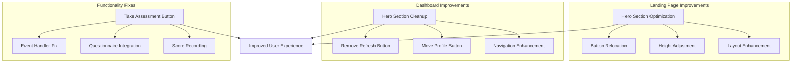

# Design Document

## Overview

This design document outlines the specific UI improvements and functionality fixes for the GlucoBalance application. The improvements focus on optimizing the user interface layout, enhancing navigation patterns, and ensuring all interactive elements function correctly. The design maintains the existing Azure Blue (#007FFF) and White aesthetic while creating a more polished and professional user experience.

The improvements address three key areas: landing page hero section optimization, dashboard navigation enhancement, and critical button functionality fixes. These changes will create a more streamlined user experience while maintaining the application's existing functionality and design language.

## Architecture

### Current System Analysis

Based on the existing codebase analysis, the application has:

- **Landing Page Structure**: Managed by `LandingPageManager` class in `js/landing-page.js`
- **Dashboard System**: Controlled by `EnhancedDashboard` class in `js/enhanced-dashboard.js`
- **Risk Assessment Engine**: Handled by `RiskAssessmentEngine` class in `js/risk-assessment.js`
- **Navigation System**: Integrated across multiple components with top navigation bar

### Improvement Architecture



## Components and Interfaces

### 1. Landing Page Hero Section Optimization

#### Current Structure Analysis
The hero section currently contains:
- Hero background with gradient and floating elements
- Main content with title, subtitle, and CTA buttons
- Statistics display
- Trust indicators
- Visual illustration section

#### Proposed Changes

##### Button Relocation System
```javascript
interface HeroButtonManager {
  relocateGetStartedButton(): void
  updateNavigationBar(): void
  maintainResponsiveDesign(): void
}
```

**Implementation Strategy:**
1. Remove the existing "Get Started Free" button from hero CTA section
2. Add the button to the top navigation bar alongside existing action buttons
3. Update button styling to match navigation bar aesthetic
4. Ensure responsive behavior across all device sizes

##### Height Optimization System
```javascript
interface HeroLayoutOptimizer {
  calculateOptimalHeight(): number
  adjustVerticalSpacing(): void
  optimizeContentDistribution(): void
  maintainVisualHierarchy(): void
}
```

**Layout Improvements:**
- Reduce excessive vertical padding in hero section
- Optimize spacing between hero elements
- Improve content-to-whitespace ratio
- Maintain visual impact while reducing height

### 2. Dashboard Hero Section Enhancement

#### Current Structure Analysis
The dashboard hero section includes:
- Hero background with pattern and gradient
- Greeting and user name display
- Statistics display (risk score, mood, progress)
- Action buttons (refresh and profile)

#### Proposed Changes

##### Navigation Integration System
```javascript
interface DashboardNavigationManager {
  moveProfileToNavigation(): void
  removeRefreshFromHero(): void
  updateHeroLayout(): void
  maintainFunctionality(): void
}
```

**Implementation Strategy:**
1. Remove refresh button from hero actions section
2. Move profile button from hero to top navigation bar
3. Implement alternative refresh mechanisms (auto-refresh, pull-to-refresh)
4. Clean up hero section layout for better focus on health metrics

### 3. Take Assessment Button Functionality Fix

#### Current Issue Analysis
Based on the code review, the Take Assessment button may have integration issues between:
- Dashboard button click handler
- Risk assessment engine initialization
- Questionnaire display system
- Score recording and display

#### Proposed Solution

##### Assessment Integration System
```javascript
interface AssessmentIntegrationManager {
  initializeAssessmentEngine(): Promise<void>
  handleButtonClick(): void
  ensureQuestionnaireDisplay(): void
  recordAndDisplayScore(): Promise<void>
}
```

**Fix Implementation:**
1. Verify and fix event handler binding for Take Assessment button
2. Ensure proper initialization of RiskAssessmentEngine
3. Fix questionnaire display and navigation
4. Implement proper score recording and dashboard card updates
5. Add error handling and fallback mechanisms

## Data Models

### UI State Management

```javascript
interface UIState {
  landingPage: {
    heroHeight: number
    buttonLocations: ButtonLocation[]
    layoutOptimized: boolean
  }
  dashboard: {
    heroCleanedUp: boolean
    navigationEnhanced: boolean
    refreshMechanism: RefreshType
  }
  assessment: {
    buttonFunctional: boolean
    scoreRecorded: boolean
    cardUpdated: boolean
  }
}

interface ButtonLocation {
  id: string
  originalLocation: 'hero' | 'navigation'
  newLocation: 'hero' | 'navigation'
  styling: ButtonStyle
}

enum RefreshType {
  AUTO_REFRESH = 'auto',
  PULL_TO_REFRESH = 'pull',
  MENU_OPTION = 'menu'
}
```

### Assessment Integration Data

```javascript
interface AssessmentIntegration {
  buttonId: string
  engineClass: string
  questionnaireContainer: string
  scoreDisplayElement: string
  cardUpdateTarget: string
}
```

## Implementation Strategy

### Phase 1: Landing Page Hero Optimization

#### Step 1: Button Relocation
1. **Identify Current Button**: Locate "Get Started Free" button in hero section
2. **Create Navigation Button**: Add button to top navigation bar
3. **Update Styling**: Apply navigation bar button styles
4. **Remove Hero Button**: Clean up hero CTA section
5. **Test Responsiveness**: Ensure proper display across devices

#### Step 2: Height and Layout Optimization
1. **Analyze Current Dimensions**: Measure existing hero section height
2. **Calculate Optimal Height**: Determine appropriate height reduction
3. **Adjust CSS Variables**: Update height-related CSS properties
4. **Optimize Spacing**: Improve vertical spacing between elements
5. **Maintain Visual Impact**: Ensure hero section remains impressive

### Phase 2: Dashboard Navigation Enhancement

#### Step 1: Profile Button Migration
1. **Locate Profile Button**: Find current profile button in hero section
2. **Add to Navigation**: Create profile button in top navigation bar
3. **Update Event Handlers**: Ensure functionality is maintained
4. **Remove from Hero**: Clean up hero actions section
5. **Style Integration**: Match navigation bar aesthetic

#### Step 2: Refresh Button Removal
1. **Remove Hero Refresh**: Delete refresh button from hero section
2. **Implement Auto-Refresh**: Add automatic data refresh mechanism
3. **Add Pull-to-Refresh**: Implement mobile-friendly refresh gesture
4. **Menu Integration**: Add refresh option to navigation menu if needed

### Phase 3: Assessment Button Functionality Fix

#### Step 1: Diagnosis and Analysis
1. **Test Current Behavior**: Document exact failure points
2. **Trace Event Flow**: Follow button click through to questionnaire
3. **Identify Broken Links**: Find disconnected event handlers or missing initializations
4. **Check Dependencies**: Verify all required classes and methods are available

#### Step 2: Implementation Fix
1. **Fix Event Binding**: Ensure proper event listener attachment
2. **Initialize Engine**: Verify RiskAssessmentEngine initialization
3. **Fix Navigation**: Ensure smooth transition to questionnaire
4. **Implement Score Recording**: Fix score storage and display update
5. **Add Error Handling**: Implement fallback mechanisms

## Error Handling

### UI Optimization Error Handling

```javascript
class UIOptimizationErrorHandler {
  static handleButtonRelocationError(error) {
    console.error('Button relocation failed:', error);
    // Fallback: Keep button in original location
    this.revertButtonLocation();
  }
  
  static handleLayoutOptimizationError(error) {
    console.error('Layout optimization failed:', error);
    // Fallback: Use original layout dimensions
    this.revertLayoutChanges();
  }
  
  static handleAssessmentIntegrationError(error) {
    console.error('Assessment integration failed:', error);
    // Fallback: Show error message and alternative access
    this.showAssessmentErrorFallback();
  }
}
```

### Graceful Degradation Strategy

1. **Progressive Enhancement**: Ensure basic functionality works even if optimizations fail
2. **Fallback Mechanisms**: Provide alternative access methods for critical features
3. **Error Recovery**: Implement automatic recovery for temporary failures
4. **User Feedback**: Show clear error messages and alternative actions

## Testing Strategy

### UI Optimization Testing

#### Visual Regression Testing
1. **Before/After Screenshots**: Compare layouts before and after changes
2. **Cross-Device Testing**: Verify improvements across different screen sizes
3. **Browser Compatibility**: Test across major browsers
4. **Accessibility Testing**: Ensure improvements don't break accessibility

#### Functionality Testing
1. **Button Functionality**: Verify all relocated buttons work correctly
2. **Navigation Flow**: Test complete user journeys
3. **Assessment Integration**: Thoroughly test assessment button functionality
4. **Score Recording**: Verify score persistence and display updates

#### Performance Testing
1. **Layout Performance**: Measure impact of layout changes on rendering
2. **JavaScript Performance**: Ensure event handler changes don't impact performance
3. **Mobile Performance**: Test on actual mobile devices

### Test Cases

```javascript
describe('UI Improvements', () => {
  describe('Landing Page Hero Optimization', () => {
    test('should move Get Started button to navigation', () => {
      // Test button relocation
    });
    
    test('should reduce hero section height appropriately', () => {
      // Test height optimization
    });
    
    test('should maintain responsive design', () => {
      // Test across breakpoints
    });
  });
  
  describe('Dashboard Navigation Enhancement', () => {
    test('should move profile button to navigation', () => {
      // Test profile button migration
    });
    
    test('should remove refresh button from hero', () => {
      // Test refresh button removal
    });
    
    test('should implement alternative refresh mechanisms', () => {
      // Test auto-refresh functionality
    });
  });
  
  describe('Assessment Button Functionality', () => {
    test('should open questionnaire on button click', () => {
      // Test button click handler
    });
    
    test('should record and display assessment score', () => {
      // Test score recording and display
    });
    
    test('should handle errors gracefully', () => {
      // Test error scenarios
    });
  });
});
```

## Security Considerations

### UI Security Best Practices

1. **Input Validation**: Ensure any new form inputs are properly validated
2. **XSS Prevention**: Sanitize any dynamic content in UI updates
3. **CSRF Protection**: Maintain CSRF protection for form submissions
4. **Content Security Policy**: Ensure UI changes comply with CSP

### Assessment Data Security

1. **Data Encryption**: Maintain encryption for assessment scores
2. **Secure Storage**: Ensure score data is stored securely
3. **Access Control**: Verify proper user authentication for assessment access
4. **Audit Logging**: Log assessment completions for security monitoring

## Performance Optimization

### CSS Optimization

1. **Minimize Reflows**: Optimize CSS changes to minimize layout recalculations
2. **Efficient Selectors**: Use efficient CSS selectors for styling updates
3. **Animation Performance**: Ensure smooth animations for UI transitions
4. **Critical CSS**: Inline critical CSS for above-the-fold content

### JavaScript Optimization

1. **Event Delegation**: Use efficient event handling patterns
2. **DOM Manipulation**: Minimize DOM queries and updates
3. **Memory Management**: Prevent memory leaks in event handlers
4. **Lazy Loading**: Implement lazy loading for non-critical UI components

This design document provides a comprehensive foundation for implementing the UI improvements while maintaining the application's existing functionality, performance, and security standards.